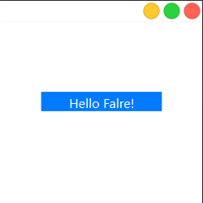

# FlareUI

This is a UI library based on Qt, which offers modern and visually appealing controls and UI features, fully compatible with Qt's functionality and advantages.

这是一个基于Qt的UI库，提供现代化和美观的控件和UI特性，完全兼容Qt的功能和优势。

[English](README_EN.md)

## 项目描述

这是我前几天没事做突然想起来想写一个UI库便有这么这么一个库
FlareUI库是一个基于Qt库扩展的UI库，是为了开发者减少使用Qss和重复造轮子的一个解决方案，基于MacOS的风格实现了一部分控件

## 功能特性

1. 较为方便的 API<br>比如在编写程序时不必要为了一些繁琐的操作去重写控件，只需要写一段代码

   ```cpp
   #include "FlareWindow.h"
   #include "PushButton.h"
   #include <QApplication>
   int main(int argc, char* argv[]) {
   	Q_INIT_RESOURCE(FlareWindow);
   	QApplication a(argc, argv);
   	Flare::FlareWindow MainWindow;
   	Flare::PushButton button("Hello Falre!", &MainWindow);
   	MainWindow.resize(200, 200);
   	button.move(40,90);
   	button.resize(120, 20);
   	MainWindow.show();
   	return a.exec();
   }
   ```

   便可以实现

   

   

2. 基于Mac的风格，一般实现一种风格需要编写很多代码，这里我将其实现了出来，你只需要new就可以享受成果了

## 开发环境

使用的是 **Qt6.6.0** 当然这不是很重要，因为代码并没有用到新版本的特性，这是基于QtWidget的，我对与qml不太熟悉所以没搞

## 安装指南

这个晚些,我写了半天的Bug还没修复

## 使用示例

使用的示例我会在我的博客中写，这里就不必了

## 贡献指南

欢迎您参与项目的贡献！

- 提交 bug 报告：请在 issue 页面上提交详细的 bug 报告，包括复现步骤和相关信息。
- 提出特性请求：在 issue 页面上提出您对项目的新想法或改进建议。
- 提交拉取请求：Fork 项目后进行修改，并通过拉取请求将修改提交给我。

请尊重他人、遵守法律法规，并遵循该项目的行为规范。

感谢您的参与和支持！如果有任何问题，请随时联系我。

我的工作邮箱是 zjh_3456789@outlook.com

## 版权信息

本项目使用 [BSD 3-Clause License](https://opensource.org/licenses/BSD-3-Clause) 进行许可。该许可证允许你自由地使用、修改和分发本项目的源代码，只要你遵守以下三条条款：

- 你必须保留原始的版权声明和许可证声明。
- 你必须在任何修改过的文件中注明你所做的改动。

如果你对本许可证有任何疑问，请参阅 [BSD 3-Clause License FAQ](https://www.gnu.org/licenses/license-list.en.html#ModifiedBSD)。

## 鸣谢

如果你也想成为贡献者之一，请参考 [贡献指南](https://bing.vcanbb.top/web/#如何贡献) 了解如何加入我们。👏

## 目前的计划

- [ ] 实现所有的Button
- [ ] 完成FlareWindow的标题栏修复工作
- [ ] 对于已有的控件进行扩展

## 相关资源

我的博客：[zjhzzy](zjhzzy.github.io)

我会在上面发布一些关于这个库的进展以及一些示例
